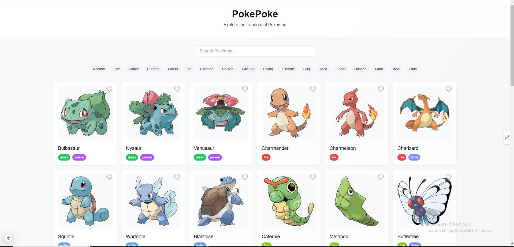
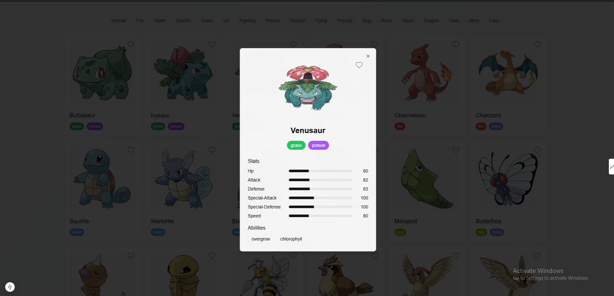
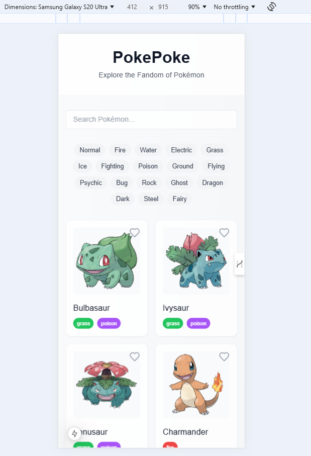
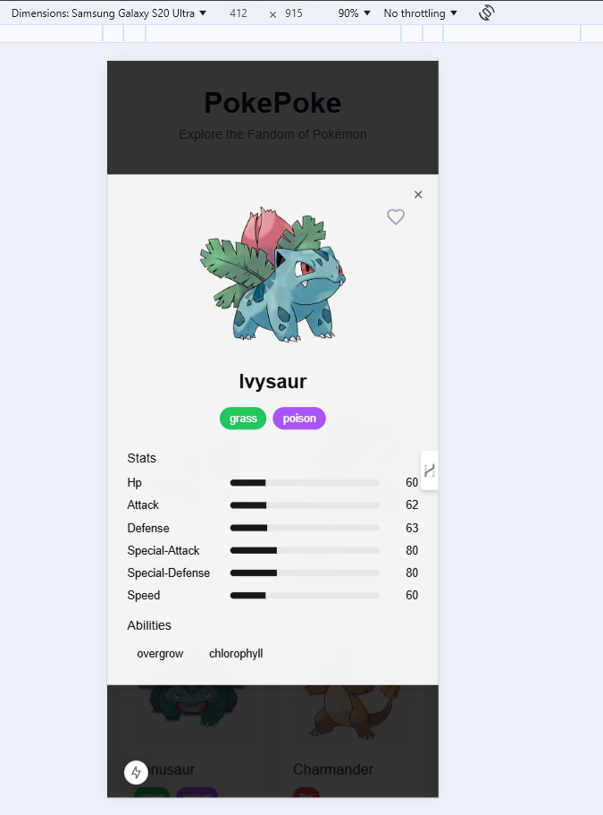

# 🎮 Pokemon Project

## 📝 Description
    Welcome to the Pokemon Project - a comprehensive web application that brings the exciting world of Pokemon to life! This project serves as an interactive Pokemon encyclopedia and battle simulator, allowing users to explore Pokemon information, create custom teams, and engage in simulated battles. Built with modern web technologies, this application demonstrates proficiency in full-stack development while providing an engaging user experience for Pokemon enthusiasts.
    The project was developed to showcase:

    Implementation of RESTful APIs and data manipulation
    Modern frontend development practices
    Responsive design principles
    User authentication and session management
    Real-time updates and interactive features

    1. Pokemon Encyclopedia

    Comprehensive Pokemon Database: Access detailed information about all Pokemon including stats, abilities, and evolution chains
    Advanced Search & Filters: Find Pokemon by type, generation, stats, or name
    Interactive Pokemon Cards: Beautiful, responsive cards displaying Pokemon information with dynamic animations
    Detailed Stats Visualization: Visual representation of Pokemon statistics using charts and graphs

    2. Team Builder

    Custom Team Creation: Build and save Pokemon teams with up to 6 Pokemon
    Move Set Management: Select and customize moves for each Pokemon
    Team Analysis: Get insights about team strengths, weaknesses, and type coverage
    Team Sharing: Share custom teams with other users via unique URLs

    3. Battle Simulator

    Real-time Battle System: Engage in turn-based battles with computer-controlled opponents
    Battle Statistics: Track win/loss ratios and battle performance
    Multiple Battle Formats: Choose from different battle formats (Single, Double, etc.)
    Move Animation: Visual feedback for different move types and effects

    ## 🛠️ Technologies Used
    - Next JS
    - Tailwind CSS


## 📋 Prerequisites
```bash
Node.js v14+
npm or yarn
```

## ⚙️ Installation
```bash
# Clone the repository
git clone https://github.com/Jenisis-03/Pokemon.git

# Navigate to the project directory
cd Pokemon

# Install dependencies
npm install
```

## 🚀 Usage
```bash
# Start the application
npm start
```

## 🎯 API Endpoints (if applicable)
| Endpoint | Method | Description |
|----------|--------|-------------|
| `/api/pokemon` | GET | Fetches all Pokemon |
| `/api/pokemon/:id` | GET | Fetches specific Pokemon |

## 📸 Screenshots






## 🧪 Testing
```bash
# Run tests
npm test
```

## 🤝 Contributing
Contributions, issues, and feature requests are welcome! Feel free to check the [issues page](https://github.com/Jenisis-03/Pokemon/issues).

## 📄 License
This project is licensed under the [MIT License](LICENSE).

## 👤 Author
**Your Name**
- GitHub: [@Jenisis-03](https://github.com/Jenisis-03)

## 🌟 Acknowledgments
- List any resources, inspiration, or people you'd like to thank

## 📞 Contact
For any questions or feedback, please reach out to [subhamwworks@gmail.com]